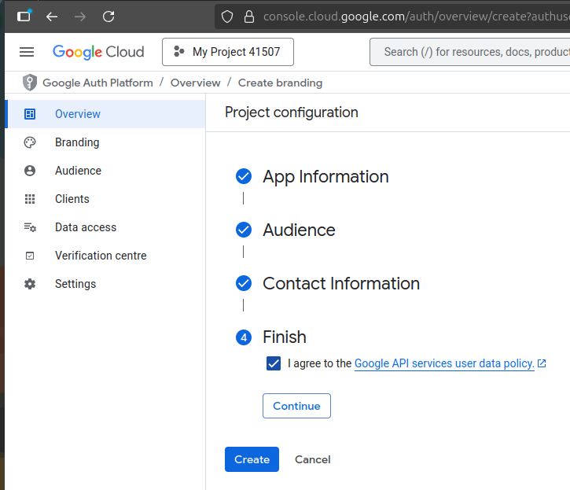
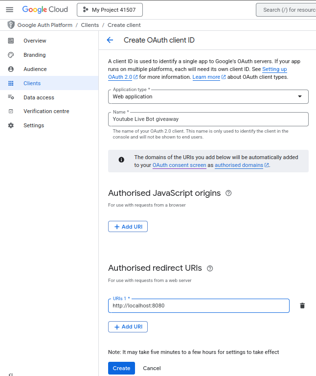

# yt-live-giveaway
 A command-line Python tool that monitors YouTube live chat on unlisted streams and manages giveaways with keyword-based entry tracking and random winner selection.
 
# Pre-requisite

Go to https://console.cloud.google.com/ and enable Youtube DATA API v3 service

Create and Oauth credential

First, create your branding
- App name and email
- Audience set to "external"

Then, create an OAuth client ID
- Go to clients and "Create a client"
- Apllication type "Web application"
- Specify your App name (This will be visible in consent screen)
- Authorised redirect URIs : "http://localhost:8080"
- Last but not least, dowload your Oauth client ID json file

    
